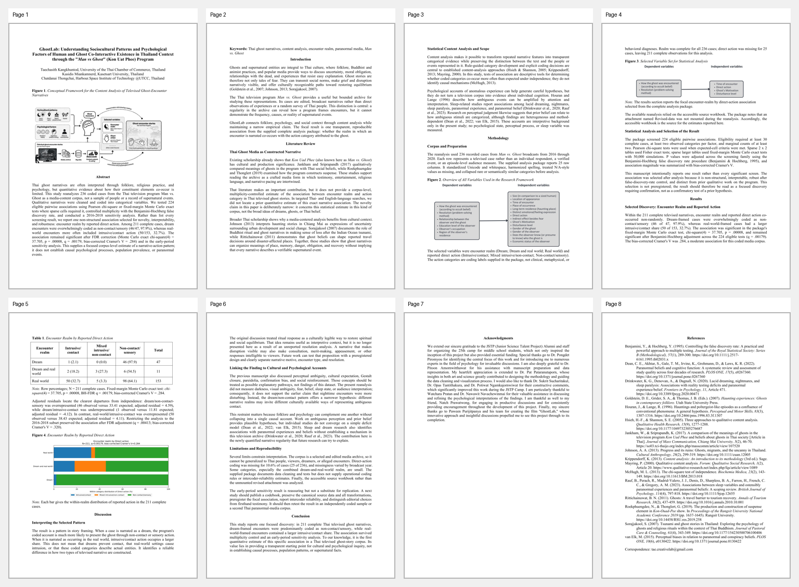

[](GhostLab_Paper_Revised_IAFOR.pdf)

# GhostLab

Open research materials for **GhostLab: Understanding Sociocultural Patterns and Psychological Factors of Human and Ghost Co-Interactive Existence in Thailand Context through the "Man vs Ghost" (Kon Uat Phee) Program**.

This repository shares the paper, coded dataset, and analysis outputs so other researchers can study, reproduce, extend, and contribute to the analysis. The project treats televised ghost encounter stories as a media-content corpus. It does not claim to prove supernatural events, population prevalence, or causal psychological mechanisms.

## Full Paper

- [GhostLab_Paper_Revised_IAFOR.pdf](GhostLab_Paper_Revised_IAFOR.pdf) - submission-ready paper.
- [GhostLab_Paper_Revised_IAFOR.docx](GhostLab_Paper_Revised_IAFOR.docx) - editable paper source.

## Dataset

- [Revised-data.xlsx](Revised-data.xlsx) - coded dataset for the Kon Uat Phee / Man vs Ghost corpus.

Quick Python load:

```python
import pandas as pd

df = pd.read_excel("Revised-data.xlsx", header=3)
df = df.dropna(axis=1, how="all")
df = df.dropna(how="all")
print(df.shape)
print(df.head())
```

The spreadsheet contains case-level coded variables such as on-air date, clothing, ghost size, external appearance, location of appearance, time of encounter, encounter realm, haunting locus, expressed emotion, direct action, indirect consequence, motivation, encounter route, resolution method, disturbance level, ghost/observer sex, observer relationship, education, economic status, occupation, region, and province.

## Analysis Package

The [analysis_package](analysis_package) folder contains reusable outputs from the complete statistical analysis:

- `analysis_results.json` - machine-readable analysis results.
- `GhostLab_Complete_Statistical_Analysis.xlsx` - workbook with dashboard, methodology, factor summaries, pairwise tests, significant associations, residuals, cleaned data, and codebook.
- `GhostLab_Complete_Statistical_Report.html` - self-contained report.
- `association_*.png`, `factor_*.png`, and `summary_*.png` - generated figures for follow-up study.

The final paper focuses on one selected discovery rather than reporting every significant association: encounter realm by reported direct action.

## Reuse and Credit

These materials are free to use under the license in [LICENSE.md](LICENSE.md), with attribution required.

Please credit the main creator:

**Taechasith Kangkhuntod**

Suggested citation:

> Kangkhuntod, T., Miankamnerd, K., & Thongchai, C. (2026). *GhostLab: Understanding Sociocultural Patterns and Psychological Factors of Human and Ghost Co-Interactive Existence in Thailand Context through the "Man vs Ghost" (Kon Uat Phee) Program*. GhostLab open research repository.

## Contributing

Contributions are welcome. Useful contributions include:

- checking or improving coded cases;
- adding transparent documentation for new variables;
- rerunning analyses with reproducible scripts;
- adding robustness checks or alternative statistical models;
- improving visualizations or data dictionaries;
- opening issues for questionable coding, missing provenance, or interpretation risks.

Please read [CONTRIBUTING.md](CONTRIBUTING.md) before submitting changes.

## Repository Structure

```text
.
|-- GhostLab_Paper_Revised_IAFOR.docx
|-- GhostLab_Paper_Revised_IAFOR.pdf
|-- Revised-data.xlsx
|-- analysis_package/
|-- tmp_paper_rewrite/rendered_v8_pdf_contact.png
|-- CITATION.cff
|-- CONTRIBUTING.md
|-- LICENSE.md
`-- README.md
```

## Research Scope

This is a media-content and narrative-analysis project. The dataset represents coded televised stories, not verified supernatural events and not a random sample of Thai people. Associations should be interpreted as corpus-level narrative patterns.
